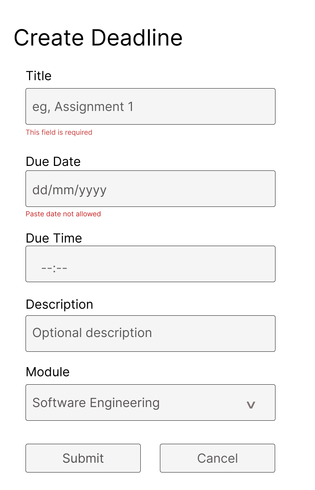

# StudyFlow - Checkpoint 3

**Team:** Group A
**Members:**
- Oisín Goden
- Michael Flanagan
- Ryan Farrell
- Tony Nicoletti

## Overview
This repository contains Checkpoint 3 deliverables for StudyFlow, a student collaberation and learning system.

## What is StudyFlow
StudyFlow is a comprehensive system helping students manage their academic work. 

-------------------------

## Tony Nicoletti

## US-1 Admin Creates a Deadline 
